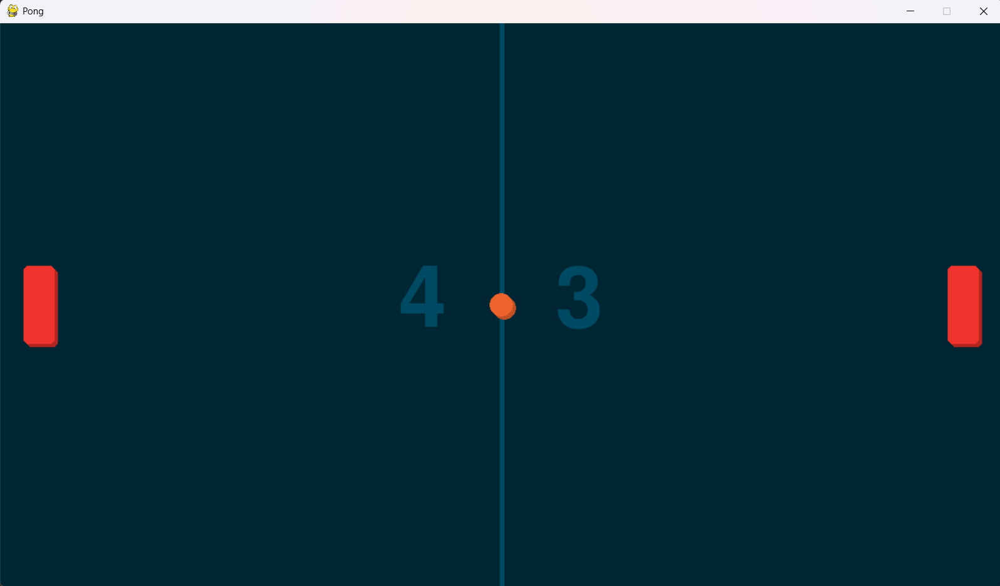
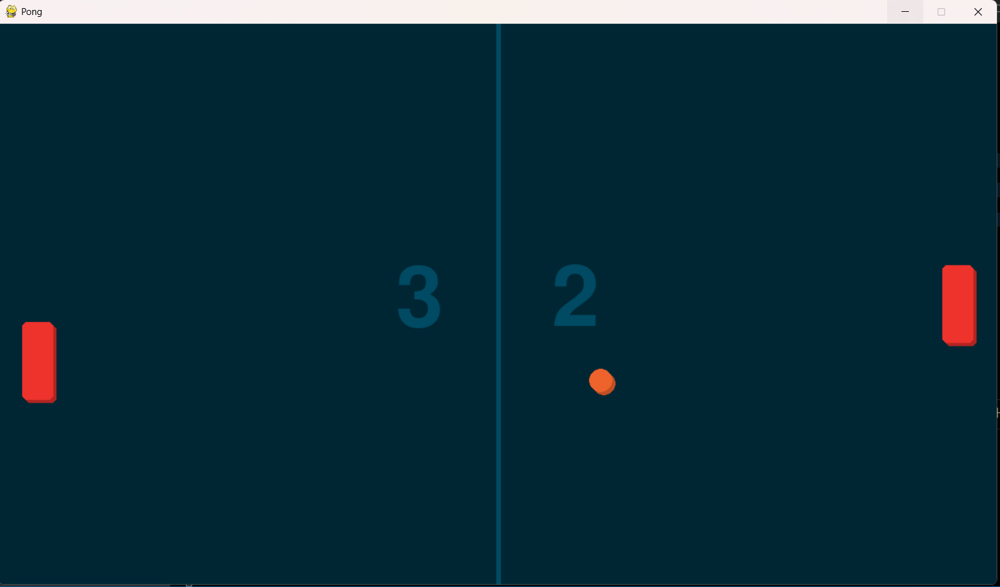

# Pong Game

A classic Pong arcade game built with Pygame.

  

## Description

This is a traditional Pong game where you control a paddle to hit the ball past your opponent's paddle.

## Features

- Player controls with keyboard (UP/DOWN arrows)
- AI opponent with smooth tracking
- Ball physics with paddle collision detection
- Persistent score storage (saved in `data/score.txt`)
- Visual effects with shadows
- 1.2 second ball speed delay at the start of each round

## How to Play

- **Move paddle up**: Press `UP` arrow key
- **Move paddle down**: Press `DOWN` arrow key
- Hit the ball past your opponent to score points
- First to reach the highest score wins!

## Installation

1. Make sure you have Python and Pygame installed:
pip install pygame

    Clone the repository:

git clone https://github.com/yourusername/pong-game.git
cd pong-game

    Run the game:

python main.py

pong-game/
├── main.py           # Game loop and initialization
├── settings.py       # Game constants and configuration
├── sprites.py        # Paddle, Ball, and Opponent classes
├── groups.py         # Sprite group with shadow rendering
├── data/
│   └── score.txt     # Persistent score storage
└── screenshots/      # Game screenshots

Future Plans

    Sound effects for ball hits and scoring

    Pause menu with resume and quit options

Technologies Used

    Python 3.x
    Pygame library

License

This project is open source and available under the MIT License.
text
